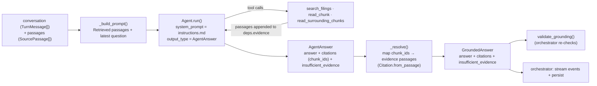

# Assistant — Grounded-Answer Agent

The generation stage of the chat pipeline: a PydanticAI agent that answers the
user's question strictly from retrieved passages, plus the shared data types
(`SourcePassage`, `Citation`, `GroundedAnswer`) that form the contract between
retrieval, the agent, grounding, streaming, and persistence.

The agent is deliberately narrow. It does **not** do retrieval up front, does
**not** decide whether to call the LLM, and does **not** enforce the final
citation rules. It only:

1. Takes the retrieved passages and the conversation, and
2. Produces an answer plus the `chunk_id`s it cites (or a refusal flag),
   optionally widening its evidence by calling bounded search/read tools.

Everything around it — the trust rules and the orchestration — lives in
[`app/grounding/validator.py`](../grounding/validator.py) and
[`app/chat/orchestrator.py`](../chat/orchestrator.py). See the
[retrieval README](../retrieval/README.md) for the full end-to-end pipeline.

## How it works

### Key pieces

- **`instructions.md`** — the system prompt. Read at import time and bound to
  every `Agent`. It's the product contract: answer only from retrieved
  passages, take exactly one of two forms (cited answer or refusal), never
  invent facts, never give investment advice. Changes to the prompt change the
  product — tests cover the grounding contract, not mocked LLM behavior.
- **`AgentAnswer`** (`agent.py`) — the structured model output. The LLM must
  emit `answer`, a list of `citations` (chunk UUIDs), and an optional
  `insufficient_evidence` flag. The schema makes the two-form contract
  machine-checkable.
- **`DocAgentDeps`** — per-run runtime state. Its `evidence` list accumulates
  **every** passage surfaced to the model: the initial retrieval plus anything
  the tools returned. Citations are resolved against this list, so the model
  can only ever cite what it actually saw.
- **`_resolve()`** — turns model output into a `GroundedAnswer`. A cited
  `chunk_id` that isn't in `evidence` (a hallucinated id) becomes a controlled
  `GroundingError`; display metadata and excerpts are re-derived from the
  passage, never from the model. This mirrors `validate_grounding`; the
  orchestrator re-runs that validator as the enforcement backstop.
- **`DocumentCopilotAgent`** — implements the `AnswerAgent` Protocol from
  `orchestrator.py`. Wraps a PydanticAI `Agent` with the OpenAIChatModel from
  config, the shared instructions, the three tools, and the structured output
  schema. `generate()` builds the prompt, runs the agent with the conversation
  history, resolves the output, and returns `(GroundedAnswer, evidence)`.

## Tools

The agent can expand its evidence mid-generation through three bounded tools:

| Tool | Purpose | Backed by |
|---|---|---|
| `search_filings(query, top_k)` | Re-run hybrid retrieval for a follow-up query; returns formatted passages. | `HybridRetriever.retrieve()` |
| `read_chunk(chunk_id)` | Read the full text of one chunk by id. | `fetch_chunk()` in `app/retrieval/queries.py` |
| `read_surrounding_chunks(chunk_id, window)` | Read the `window` passages before/after a chunk for context. Window clamped to `_MAX_SURROUNDING_WINDOW` (5). | `fetch_surrounding()` |

Every passage a tool returns is appended to `deps.evidence` before being shown
to the model, so the resolution step has the full picture of what the model
could cite.

## Output types (`outputs.py`)

Deliberately pure dataclasses — no I/O — so every stage is unit-testable
without a database or LLM:

- **`SourcePassage`** — one retrieved chunk with document metadata and an
  optional semantic `score`.
- **`Citation`** — a fully-resolved reference to a passage, ready for display.
  `Citation.from_passage()` builds it from a passage so fields always come from
  the database. `to_dict()` / `display_metadata()` produce the wire shapes the
  frontend and `message_citations.metadata` expect.
- **`GroundedAnswer`** — the answer plus the citations it relies on;
  `insufficient_evidence` marks a citation-less refusal.

## Defaults

| Setting | Default | Where |
|---|---|---|
| Chat model | `gpt-4o` | `config.py:44` |
| `search_filings` default `top_k` | 5 | `agent.py:72` |
| `read_surrounding_chunks` default window | 2 | `agent.py:94` |
| `_MAX_SURROUNDING_WINDOW` | 5 | `agent.py:37` |

## Where it plugs in

- `DocumentCopilotAgent` is the default `AnswerAgent` (`orchestrator.py`), so
  the chat stream endpoint uses it without changes.
- The orchestrator passes the retrieved `passages` into `generate()`, then runs
  `validate_grounding()` on the result as the final enforcement boundary before
  streaming/persisting.
