# Retrieval & Grounding Pipeline

Hybrid search over `document_chunks`: pgvector cosine similarity and Postgres
full-text search run independently, then their ranked lists are fused by
Reciprocal Rank Fusion (RRF) into a single score-ordered list of
[`SourcePassage`](../assistant/outputs.py) objects carrying the document
metadata needed for display. A grounded-answer agent generates the reply from
those passages, and the grounding validator enforces that every citation points
back to a passage that was actually retrieved.

This package is the *request path* — it answers "given a user query, which
chunks are relevant, and how do we prove the answer used them?". The other half
of the pipeline, producing the chunks, embeddings, and `search_vector` that
this package queries, lives in [`backend/ingest/`](../../ingest/). Schema and
indexes live in the Alembic migration `c5aad791929d_initial_schema.py`.

## How the pipeline works

```mermaid
flowchart LR
    Q["user query"] --> EMB["embed_query()<br/>OpenAI text-embedding-3-small · 1536-dim"]
    Q --> KWX["extract_keywords()<br/>rule-based · 3-5 content terms"]
    KWX --> KW["keyword_search()<br/>to_tsquery('english') OR terms · GIN<br/>ts_rank ranking"]

    subgraph ingest["INGEST (offline, backend/ingest/)"]
        CHUNK["HybridChunker (Docling)<br/>token-aware · ~1.5k-word chunks"] --> VEC["OpenAI embeddings<br/>1536-dim"]
        VEC --> ROW["document_chunks row<br/>embedding + search_vector (generated tsvector)"]
        CHUNK --> ROW
    end

    EMB --> SEM["semantic_search()<br/>pgvector &lt;=&gt; cosine · HNSW<br/>vector_cosine_ops"]
    SEM --> FUSE["reciprocal_rank_fusion(k=60)"]
    KW --> FUSE
    FUSE --> TOP["top_k = 5 chunk ids"]
    TOP --> PASS["row_to_passage() → [SourcePassage]<br/>score = 1 − cosine distance"]
    ROW -.queries read.-> SEM
    ROW -.queries read.-> KW

    PASS --> GATE["run_turn()<br/>best score ≥ min_relevance_score (0.45)?"]
    GATE -->|"no — deterministic refusal, no LLM call"| REFUSE["GroundedAnswer(insufficient_evidence=True)"]
    GATE -->|"yes"| AGENT["PydanticAI agent<br/>answer + chunk_ids it cites"]
    AGENT -->|"may call tools"| TOOLS["search_filings · read_chunk<br/>read_surrounding_chunks"]
    TOOLS --> AGENT
    AGENT --> EV["evidence list (retrieved + tool results)"]
    EV --> VAL["validate_grounding()<br/>citations ⊆ evidence · re-derive display fields"]
    VAL --> ANS["GroundedAnswer → stream events / persist"]
```



### Stage by stage

1. **Embed the query** — [`embed_query()`](embedding.py) lazily builds a single
   `AsyncOpenAI` client and embeds the query with the configured model and
   dimensions. It is async so the request path never blocks on network I/O; the
   ingest side uses the same model/dimensions but a sync client
   (`ingest/embeddings.py`) because it runs in one-off scripts.

2. **Semantic search** — [`semantic_search()`](queries.py) runs
   `c.embedding <=> CAST(:query_embedding AS vector)`, ordered by ascending
   cosine distance, limited to `candidate_k`. The HNSW index
   (`vector_cosine_ops`) accelerates this. The embedding is passed as a
   formatted `"[0.1, 0.2, ...]"` string; the explicit `::vector` cast makes the
   coercion to the HNSW column type unambiguous.

3. **Extract keyword terms** — [`extract_keywords()`](keywords.py) reduces the
   free-form query to up to `RETRIEVAL_KEYWORD_MAX_TERMS` content terms:
   lowercase, tokenize on non-alphanumeric boundaries, drop stopwords and short
   tokens, keep 4-digit years (they matter in filing queries), dedupe. Pure
   stdlib logic — no LLM, no network — so it runs on every query at zero cost.
   A verbose question like *"How many employees did Microsoft have in 2023?"*
   becomes `employees | microsoft | 2023`.

4. **Keyword search** — [`keyword_search()`](queries.py) OR-combines the
   extracted terms with `to_tsquery('english', 'term1 | term2 | …')` for
   recall (the semantic leg already covers precision) and orders by
   `ts_rank DESC`. `'english'` matches the config used to generate
   `search_vector` at ingest (a persisted generated column,
   `to_tsquery('english', chunk_text)`, backed by a GIN index). Terms are
   sanitized to `[a-z0-9]`, so there is no operator injection. When nothing
   meaningful survives extraction, it falls back to `plainto_tsquery` over the
   raw query.

   **Embed + keyword run concurrently.** Keyword search needs only the raw
   query text, not the embedding, so [`retrieve()`](retriever.py) launches the
   embedding call and the keyword query together with `asyncio.gather` — the
   OpenAI network round-trip overlaps with the keyword DB query instead of
   serializing after it. The semantic query (which does depend on the
   embedding) starts once the embedding is ready.

6. **Fuse by rank, not score** — [`reciprocal_rank_fusion()`](fusion.py). Raw
   scores are not comparable across the two retrievers: full-text `ts_rank` is
   unbounded while cosine similarity is bounded. RRF ignores scores entirely and
   combines by rank position:

   ```
   rrf_score(d) = Σ over each retriever r of 1 / (k + rank_r(d))
   ```

   with the conventional smoothing constant `k = 60` (Cormack et al., SIGIR
   2009). A chunk that ranks well in both lists accumulates contributions from
   each; results are emitted in descending fused score with no duplicates.

7. **Re-materialize passages** — [`HybridRetriever.retrieve()`](retriever.py)
   builds the two rank lists of `chunk_id`, fuses them, and takes the top
   `top_k`. Because every query row already JOINs `source_documents`, the chunk
   rows are mapped straight to `SourcePassage` via `row_to_passage()` — no
   second fetch for display metadata. `score` is `1 - cosine distance` for
   semantic hits and `None` for chunks surfaced purely by keyword search.

8. **Relevance gate** — [`run_turn()`](../chat/orchestrator.py) takes the ranked
   passages and checks the best semantic score against `min_relevance_score`.
   Below the threshold the turn refuses deterministically (`insufficient_evidence`,
   no LLM call) — the answer states the corpus doesn't support the question.

9. **Grounded answer** — the PydanticAI agent (see `app/assistant/agent.py`)
   answers strictly from the retrieved passages. Its three bounded tools can
   widen the evidence set mid-generation: `search_filings` re-runs hybrid
   retrieval on a follow-up query, and `read_chunk` / `read_surrounding_chunks`
   pull specific chunks by id (backed by `fetch_chunk()` and
   `fetch_surrounding()`). Every passage surfaced to the model — the initial
   `top_k` plus any tool results — accumulates on the agent's `evidence` list.

## Grounding: the trust contract

Grounding is what makes the answer verifiable: **a citation is only valid if it
points at a passage that was actually retrieved for this request.** Enforcement
lives in [`app/grounding/validator.py`](../grounding/validator.py) (pure logic,
no I/O) and is applied at two layers:

1. **Agent-side resolution** — `_resolve()` in `agent.py` turns the model's
   structured output into a `GroundedAnswer`. A hallucinated `chunk_id` — one
   the model cites but that isn't in its `evidence` — becomes a controlled
   `GroundingError` instead of a crash, and display metadata is rebuilt from the
   passage (`Citation.from_passage`), never from the model.

2. **Orchestrator backstop** — `validate_grounding()` in `validator.py` re-runs
   the same contract over the final answer as a hard boundary. The rules:

   - A declining answer (`insufficient_evidence=true`) **must have no citations**.
   - A non-declining answer **must cite at least one passage**.
   - Every cited `chunk_id` **must be in the retrieved evidence**.
   - The returned citations are rebuilt from the retrieved passages, so display
     fields and excerpts always come from the database — never from the model.

Because the model is trusted only for *which* chunks it cites, nothing in a
citation can be fabricated. A violation raises `GroundingError`, which the
orchestrator converts into a streamed error event; nothing is persisted.

## Default settings

| Setting | Default | Where |
|---|---|---|
| `RETRIEVAL_CANDIDATE_K` — candidates fetched per retriever | 50 | `config.py:51` (constructor default `retriever.py`) |
| `RETRIEVAL_TOP_K` — fused passages returned | 5 | `config.py:54` (chunks are ~1.5k words; keeps prompts under the token ceiling) |
| `RETRIEVAL_RRF_K` — RRF smoothing constant | 60 | `config.py:57`, used as default `k` in `fusion.py:18` |
| `RETRIEVAL_KEYWORD_MAX_TERMS` — keyword terms extracted per query | 5 | `config.py:59`, used in `queries.py:keyword_search` |
| `surrounding_chunks` window | 2 | `queries.py:83`, agent tool `agent.py:94` |
| `_MAX_SURROUNDING_WINDOW` | 5 | `agent.py:37` |
| Embedding model | `text-embedding-3-small` | `config.py:38` |
| Embedding dimensions | 1536 | `config.py:39` |
| Chunk budget (`openai_embedding_max_tokens`) | 2000 | `config.py:42` (well under the model's 8191-token input window) |
| `min_relevance_score` | 0.45 | `config.py:47` |
| Full-text config | `'english'` | `database/models/document_chunk.py:23`, migration `c5aad791929d:75` |
| Semantic index | HNSW, `vector_cosine_ops` | migration `c5aad791929d:87` |
| Keyword index | GIN on `search_vector` | migration `c5aad791929d:92` |

## Module map

| File | Purpose |
|---|---|
| [`embedding.py`](embedding.py) | Async OpenAI query embedding (lazy client, pure wrapper). |
| [`fusion.py`](fusion.py) | Reciprocal Rank Fusion — pure logic, no I/O, fully unit-testable without a database. |
| [`keywords.py`](keywords.py) | Rule-based keyword term extraction for the full-text leg — pure stdlib logic, no LLM or I/O. |
| [`queries.py`](queries.py) | Raw SQL over `document_chunks` + `source_documents`: the two search queries, the `fetch_*` helpers for the agent's chunk-reading tools, and `row_to_passage()`. Caller owns the connection. |
| [`retriever.py`](retriever.py) | `HybridRetriever` — orchestrates embed + keyword (parallel) → semantic → fuse → passages. |
| [`../grounding/validator.py`](../grounding/validator.py) | Grounding enforcement — the citation trust contract, pure logic. |

## Where it plugs in

- `HybridRetriever` implements the `Retriever` Protocol in
  [`app/chat/orchestrator.py`](../chat/orchestrator.py), so the turn lifecycle
  and the PydanticAI agent's `search_filings` tool consume it unchanged.
- The `AnswerAgent` protocol (`orchestrator.py`) is implemented by
  `DocumentCopilotAgent`; the orchestrator calls `validate_grounding()` on the
  agent's output as the enforcement backstop.
- Dependencies (embedder and both query functions) are injected via the
  constructor, so the unit tests in `backend/tests/retrieval/` exercise the full
  fuse-and-map path without ever touching the engine or OpenAI.
